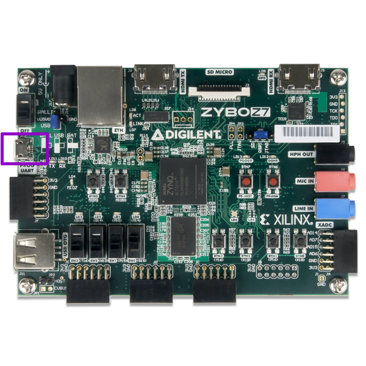

Running example designs
========================

This section describes how to properly connect your board.
It also helps you configure and run any other software that is necessary to observe results.

Connecting development boards
-----------------------------

Arty board
~~~~~~~~~~

#. Connect the board to your computer using the USB cable
#. Connect the board to your computer using the Ethernet cable
   (only if you want to test the LiteX Linux Example)

.. image:: _static/images/arty-usb-ethernet.png
   :width: 49%
   :align: center

Basys 3 board
~~~~~~~~~~~~~

Connect the Basys3 Board to your computer using the USB cable:

.. image:: _static/images/basys3-usb.png
   :width: 49%
   :align: center

Zybo-Z7 board
~~~~~~~~~~~~~

Connect the Zybo-Z7 Board to your computer using the USB cable:

Insert the SD card in the dedicated slot:

.. image:: _static/images/zyboz7-sdcard.png
   :width: 49%
   :align: center

.. _uart-connection:

Connecting to UART
------------------

First check available teletypes with:

.. code-block:: bash

   ls -l /dev | grep ttyUSB

You should see at least one, e.g.:

.. code-block:: bash

   crw-rw----+ 1 root  plugdev   188,   0 11-06 13:58 ttyUSB0
   crw-rw----+ 1 root  plugdev   188,   1 11-06 13:58 ttyUSB1

Simply use ``picocom`` to connect:

.. code-block:: bash

   picocom -b 115200 --imap lfcrlf /dev/ttyUSB1

.. warning::

   Substitute ``115200`` with the baud rate that your design uses!

.. warning::

   Please note that ``/dev/ttyUSB1`` is just an example. The number appearing may change!

.. note::

   If the picocom is unable to connect to any ``ttyUSBx`` device, you probably don't have appropriate user permissions.
   On Debian distributions, type the command below to add the user to the ``dialout`` group.
   This should resolve the missing permissions problem:

   .. code-block:: bash

      sudo usermod -a -G dialout `whoami`

Setting up TFTP
---------------

It is assumed that the server is running on port ``6069`` and uses ``/tftp`` directory.

#. Install tftp with (Ubuntu example):

   .. code-block:: bash

      sudo apt install tftpd-hpa

#. Create a directory for the server:

   .. code-block:: bash

      sudo mkdir -p /tftp
      sudo chmod 777 -R /tftp
      sudo chown tftp -R /tftp

#. Set up your TFTP configuration with:

   .. code-block:: bash

      cat << EOF | sudo tee /etc/default/tftpd-hpa
      TFTP_USERNAME="tftp"
      TFTP_DIRECTORY="/tftp"
      TFTP_ADDRESS=":6069"
      TFTP_OPTIONS="--secure"
      EOF

#. Restart the TFTP server:

   .. code-block:: bash

      sudo systemctl restart tftpd-hpa

Configuring your network interfaces
-----------------------------------

Check your network interfaces with:

.. code-block::

   ip link

Add IPv4 address to you interface:

.. code-block:: bash

   ip addr add 192.168.100.100/24 dev eth0

.. warning::

   ``192.169.100.100/24`` and ``eth0`` are just examples!

Setting up Zynq ARM CPU
------------------------

Zynq FPGAs include an ARM CPU. This guide instructs on setting up U-boot to run Linux, load bitstreams and control the Programmable Logic through the ARM CPU.

.. _prepare-sd:

Prepare SD card
~~~~~~~~~~~~~~~

#. Format the SD card by following the `official guide <https://xilinx-wiki.atlassian.net/wiki/spaces/A/pages/18842385/How+to+format+SD+card+for+SD+boot>`_.

#. Download and extract pre-built U-boot images:

   .. code-block:: bash

      mkdir uboot-linux-images
      pushd uboot-linux-images
      wget -qO- https://github.com/SymbiFlow/symbiflow-xc7z-automatic-tester/releases/download/v1.0.0/uboot-linux-images.zip | bsdtar -xf-
      popd

#. Copy U-boot images to the boot mountpoint:

   .. code-block:: bash

      cp uboot-linux-images/boot/* /path/to/mountpoint/boot/
      sync

#. Copy Arch Linux to the root mountpoint:

   .. code-block:: bash

      wget -qO- http://de5.mirror.archlinuxarm.org/os/ArchLinuxARM-armv7-latest.tar.gz | sudo tar -xvzC /path/to/mountpoint/root
      sync

#. Copy additional files and binaries to the root directory in the Arch Linux filesystem:

   .. code-block:: bash

      sudo cp -a uboot-linux-images/root/* /path/to/mountpoint/root/root/
      sync

.. note::

   ``/path/to/mountpoint`` is the path to the mounted SD card. If everything was set correctly in the formatting step, the ``boot`` and ``root`` directories should be under ``/media/<user>/``

.. note::

   ``/path/to/mountpoint/root`` contains the Arch Linux filesystem, while ``/path/to/mountpoint/root/root/`` is a directory within the filesystem itself.

.. warning::

   The ``sync`` step is crucial to let all the write buffers to complete the writing step on the SD card.

.. _uboot-load-bitstream:

Load bitstreams from U-boot
~~~~~~~~~~~~~~~~~~~~~~~~~~~

Make sure to have :ref:`prepared the SD correctly<prepare-sd>`.

#. With the SD card inserted in the PC, copy the bitstream in the boot directory:

   .. code-block:: bash

      cp <name>.bit /path/to/mountpoint/boot
      sync

#. Set the jumper J5 to SD.

   .. image:: _static/images/zyboz7-jmp.png
      :width: 49%
      :align: center

#. With the Zybo-Z7 connected insert the SD in the board's slot and switch on the board.

#. Connect to UART, see :ref:`uart-connection`.

#. Press the reset ``PS SRST`` button on the Zybo-Z7 and halt U-boot autoboot by pressing any key in the picocom terminal.

#. On the picocom terminal, you should have access to the U-boot terminal. Load the bitstream to memory:

   .. code-block:: bash

      Zynq> load mmc 0 0x10000000 <name>.bit

#. The size of the loaded bitstream appears on console:

   .. code-block:: bash

      <size> bytes read in 128 ms (15.5 MiB/s)

#. Load the bitstream to the FPGA:

   .. code-block:: bash

      Zynq> fpga loadb 0 0x10000000 <size>

