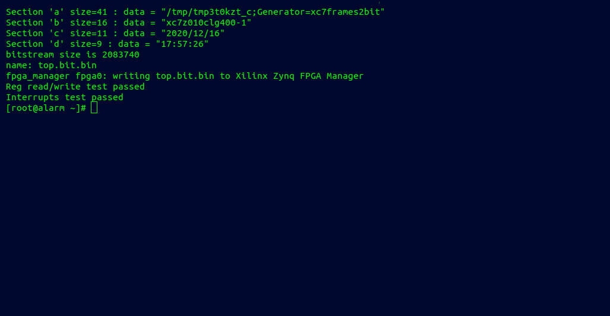

AXI Lite test
~~~~~~~~~~~~~

This example design features a simple AXI Lite bridge between the Processing System (PS)
and the Programmable Logic (PL) of a zynq-based board. To build the AXI Lite test, run:

.. code-block:: bash
   :name: example-axi-lite-zybo

   make -C axi_lite

Make sure to have gone through the `guide on how to configure Linux on Zynq <https://symbiflow-examples.readthedocs.io/en/latest/running-examples.html#configure-arch-linux-on-zynq>`_.

With the SD card connected to your PC, load the bitstream in the root directory as follows:

.. code-block:: bash

   sudo cp top.bit /path/to/mountpoint/root/root
   sync

Now, insert the SD card in the Zybo Z7 SD card slot, connect your PC with the board through the microUSB
port, and power up the Zybo Z7.

Without halting U-boot, let Linux boot and login to the console.

Install required packages and libraries to allow the automatic testing of the AXI Lite bitstream:

.. code-block:: bash

   pacman -S python make gcc python-pip
   pip install fnctl

Compile code to load and test the bitstream from Linux onto the FPGA:

.. code-block:: bash

   make -C devmemX && make install -C devmemX
   pushd zynq_bootloader/bit2bitbin
   gcc bit2bitbin.c -o bit2bitbin
   cp bit2bitbin /usr/bin
   popd

Now that everything is set-up, you can run the python script to load and test the AXI Lite register bitstream.

.. code-block:: bash

   python symbiflow_test.py --module symbiflow-tester.ko --module_name symbiflow_tester --bitstream top.bit --dev /dev/symbiflow-tester0 --driver_name symbiflow-tester

The output on the Linux terminal should be as follows:

