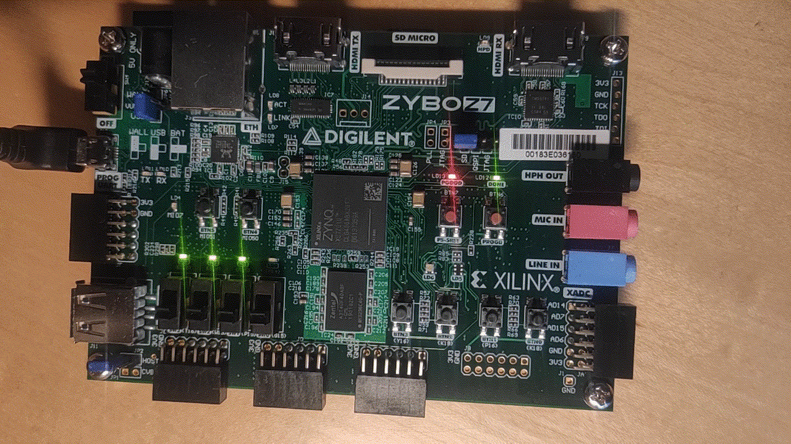
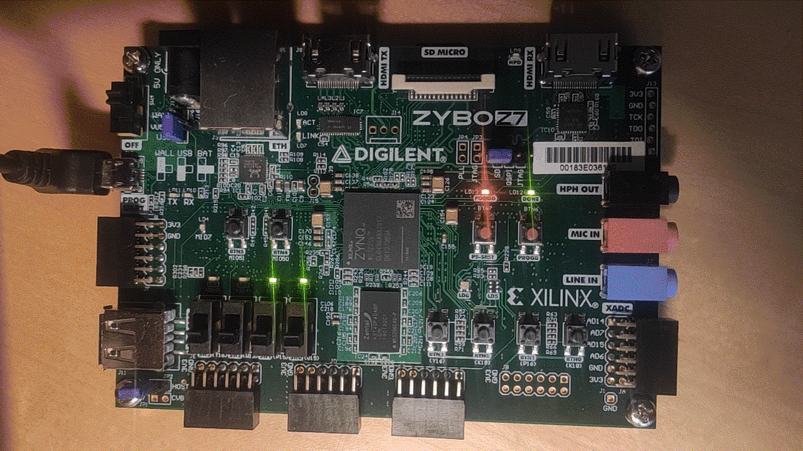

Counter test
~~~~~~~~~~~~

This example design features a simple 4-bit counter driving LEDs. To build the
counter example, depending on your hardware, run:

.. code-block:: bash
   :name: example-counter-a35t-group

   TARGET="arty_35" make -C counter_test

.. code-block:: bash
   :name: example-counter-a100t-group

   TARGET="arty_100" make -C counter_test

.. code-block:: bash
   :name: example-counter-nexys4ddr-group

   TARGET="nexys4ddr" make -C counter_test

.. code-block:: bash
   :name: example-counter-basys3-group

   TARGET="basys3" make -C counter_test

.. code-block:: bash
   :name: example-counter-nexys_video-group

   TARGET="nexys_video" make -C counter_test

.. code-block:: bash
   :name: example-counter-zybo-group

   TARGET="zybo" make -C counter_test

At completion, the bitstreams are located in the build directory:

.. code-block:: bash

   counter_test/build/<board>

Now, for **Arty and Basys3**, you can upload the design with:

.. code-block:: bash

   TARGET="<board type>" make download -C counter_test

The result should be as follows:

.. image:: ../../docs/images/counter-example-arty.gif
   :align: center
   :width: 50%

For **Zybo**, please follow the `guide on how to load a bitstream from U-boot <https://f4pga-examples.readthedocs.io/en/latest/running-examples.html#load-bitstream-from-u-boot>`_.

Once the bitstream is loaded, the result should be as follows:

On the picocom terminal, you can control the counter behaviour to stop it, or let it count backwards, by toggling values of the EMIO pins of the ARM Processing System (PS).

You can control the counter enable signal with:

.. code-block:: bash

   gpio set 54
   gpio clear 54

If GPIO 54 is set, the counter is disabled. It is enabled if the GPIO 54 is cleared. The result should be as follows:

.. image:: ../../docs/images/counter-example-zyboz7-clken.gif
   :align: center
   :width: 50%

You can control the counter direction with:

.. code-block:: bash

   gpio set 55
   gpio clear 55

If GPIO 55 is set, the counter goes backwards. It goes forwared if the GPIO 54 is cleared. The result should be as follows:

