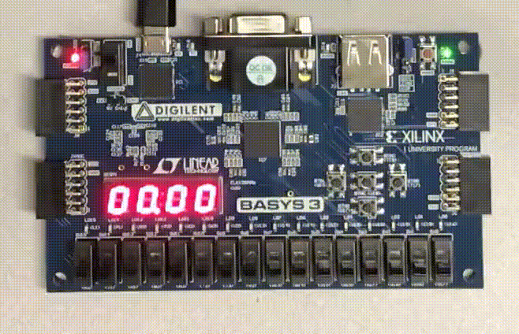

Timer
~~~~~~

This example is built specifically for the basys3 and demonstrates a greater variety of I/O 
then previous designs. It also demonstrates F4PGA's support for code written in System Verilog 
as well as its support of dictionaries in XDCs. To build this example run the following commands:

.. code-block:: bash
   :name: example-watch-basys3

   make -C timer

At completion, the bitstream is located in the build directory:

.. code-block:: bash

   timer/build/basys3

Now, you can upload the design with:

.. code-block:: bash

   TARGET="basys3" make download -C timer

After downloading the bitstream you can start and stop the watch by toggling switch 0 on the board.
Press the center button to reset the counter. The following gives a visual example:

